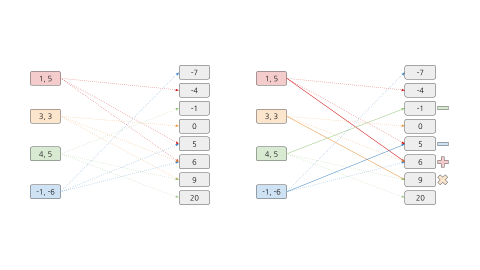

## 문제
https://www.acmicpc.net/problem/00000

## 해설
주어진 숫자 쌍에 3가지 연산자를 적용해서 모두 다른 결과를 내도록 하는 문제입니다.
*(주어진 숫자 쌍) - (주어진 숫자 쌍의 가능한 모든 연산 결과)* 를 연결한 이분 그래프를 만들고, 이분 매칭을 하면 됩니다. 왼쪽 노드가 모두 연결되면 해당하는 연산식을 사용하면 되고, 연결될 수 없으면 문제를 해결할 수 없습니다.

### 시간복잡도 계산
DFS를 사용한 이분 매칭의 시간복잡도는 $O(V \times E)$ 입니다. 여기서 V는 숫자 쌍의 갯수인 n이고, 연산자가 3가지이므로 E는 3n입니다.
$1 \leq n \leq 2500$ 이므로 이분 매칭으로 제한 시간 안에 해결할 수 있습니다.

### 구현
정석적인 이분 매칭입니다.

## 소스 코드
http://boj.kr/8d632e8516e64d75ac6c187ee2c8734f

---

## 참고