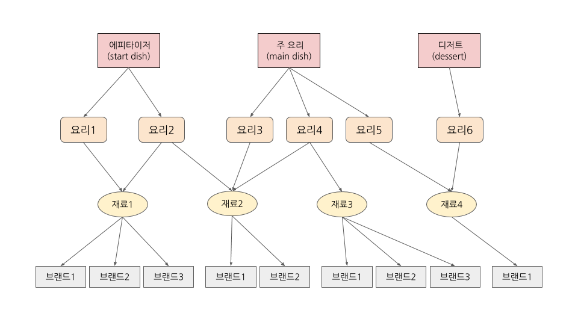

## 문제
https://www.acmicpc.net/problem/11676

## 해설
셰프가 요리할 수 있는 코스의 경우의 수를 세는 문제입니다. 설명이 복잡해 보이지만 요약하면 아래 그림과 같습니다.

1. 1가지 코스에서 3가지 요리(에피타이저, 주 요리, 디저트)가 나옵니다.
2. 에피타이저로 나올 수 있는 요리와 주 요리로 나올 수 있는 요리, 디저트로 나올 수 있는 요리는 각각 따로 정해져 있습니다. 이 때, 한 코스에 동시에 나올 수 없는 요리의 쌍이 존재합니다. 
3. 하나의 요리는 한 개 이상의 재료를 사용하고, 같은 재료를 공유하는 요리가 있을 수 있습니다.
4. 재료마다 브랜드를 선택할 수 있으며, 같은 재료는 같은 브랜드를 사용합니다.

### 시간복잡도 계산
각 요리의 종류가 25가지 이하이므로( $1 \leq s, m, d \leq 25$ ), 모든 경우의 수를 확인하더라도 $25^3 = 15625$ 가지 밖에 되지 않습니다.
요리를 정했다면 재료는 고정이고, 브랜드는 재료마다 다르므로 곱해주기만 하면 됩니다. 따라서 Brute-force로도 충분히 해결 가능합니다.

### 구현
Brute-force 구현 자체는 간단하나, Overflow 체크에 주의해야 합니다. 경우의 수가 10^18 초과이면 "too many"를 출력하는데, 브랜드의 최대 가짓수가 100가지이므로 최악의 경우에 10^18 * 100을 계산해야 합니다. 이는 `long long`범위를 초과하기 때문에 곱셈을 하기 전에 미리 Overflow가 일어날지 확인해보아야 합니다.

## 소스 코드
http://boj.kr/a3d7744cd3bf4715b8d9e6d24868aa3a

## 코멘트
Discription이 알고리즘 난이도에 비해 매우 길어서 힘들었습니다.

---

## 참고
